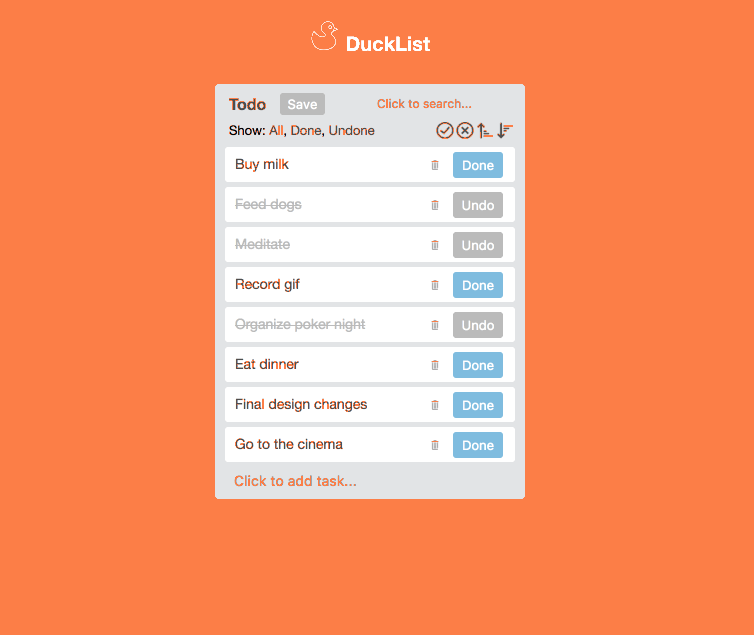

# DuckList

Todo app inspired by Trello.

## User Stories

- [x] User can see the list of Todo items on the home page
- [x] The Todo list and items should be inspired by a list on the Trello board
- [x] User can click a Done button next to an undone item to complete it
- [x] User can click an Undo button next to a done item to undo it
- [x] User can add a new Todo item and Submit
- [x] Sort tasks alphabetically (A-Z & Z-A)
- [x] Sort by showing done / undone tasks first
- [x] Delete items
- [x] Search for items
- [x] Show all / only done / only undone items
- [x] Sort items by drag & drop
- [x] Save items after re-ordering them by drag & drop